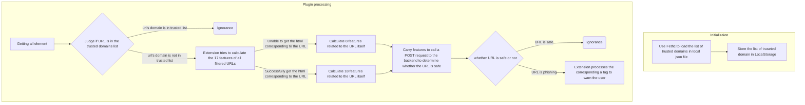

# Health-URL-Check

## 1. Frontend of EXtension

The extension code is currently written by `html+javascript+css`, the front-end flow chart of the execution is shown below:




## 2. Front-end communication format definition

> The communication format is json format

- Request format：

  ```json
  {
      "url": "https://www.baidu.com/img/1",
      "features": [
      	"feature1": 1,
          "feature2": 1,
          "feature3": 1,
          "feature4": 1,
          "feature5": 1,
          "feature6": 1,
          "feature7": 1,
          "feature10": 1,
          "feature11": 1,
          "feature12": 1,
          "feature13": 1,
          "feature14": 1,
          "feature15": 1,
          "feature16": 1,
          "feature20": 1,
          "feature21": 1,
          "feature23": 1,
      ]
  }
  ```

- Response format：

  ```json
  {
      "code": 0,						// 0 -> success -1 -> failed
      "msg": "",						// if failed, put error message here
      "data": {
          "security": true			// indicate if url is security
      }
  }
  ```

  
