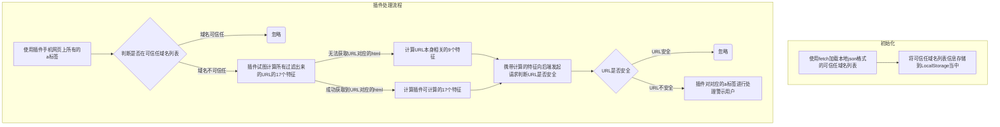

# Health-URL-Check

## 1. 插件前端

目前插件端代码是由`html+javascript+css` 编写的，具体代码执行整体的流程图如下所示：



### 1.2 初始化

- 流程图：

  ```mermaid
  graph TB
  	subgraph 初始化
  		b1[使用fetch加载本地json格式的可信任域名列表] --> b2[将可信任域名列表信息存储到LocalStorage当中]
  	end
  ```

  

- 描述：

  1. 首先通过`fetch` 拉取本地的 `security_urls.json` 文件，该文件中包含可信任的域名列表；

     示例如下：

     ```json
     {
         "pinningtest.appspot.com":true,
         "pinning-test.badssl.com":true,
         "example.test":true
     }
     ```

  2. 接着使用 `chrome.storage.local.set` API，将可信任域名列表存储到LocalStorage当中

- 代码：

  ```javascript
  const url = chrome.runtime.getURL("data/security_urls.json");
  fetch(url)
      .then(response => {
          response.redirected
          return response.json();
      })
      .then(json => {
          chrome.storage.local.set(json, () => {
              console.log("save successful");
          });
      })
      .catch(err => {
          console.log(err);
      });
  ```

### 1.3 插件处理流程

- 流程图：

  ```mermaid
  graph TB
  	subgraph 插件处理流程
          i1[使用插件手机网页上所有的a标签] --> i2{判断是否在可信任域名列表}
          i2 --域名可信任--> i3(忽略)
          i2 --域名不可信任--> i4[插件试图计算所有过滤出来的URL的17个特征]
          i4 --无法获取URL对应的html--> i5[计算URL本身相关的9个特征]
          i4 --成功获取到URL对应的html--> i6[计算插件可计算的17个特征]
          i5 --> i7[携带计算的特征向后端发起请求判断URL是否安全]
          i6 --> i7
          i7 --> i8{URL是否安全}
          i8 --URL安全--> i9(忽略)
          i8 --URL不安全--> i10[插件对对应的a标签进行处理警示用户]
  	end
  ```

- 描述：

  1. 首先第一步，在web页面加载完毕的时候，插件会查询当前DOM中所有的 `a` 标签；

     ```javascript
     // Get all a element in this page
     const aElements = document.getElementsByTagName("a");
     ```

  2. 接着对所有的 `a` 标签进行预处理，提取出所有的 `a` 标签的 `host` 和 `href` 属性，整理成如下格式：

     ```javascript
     [
         {
             host: "www.baidu.com",
             urls: [
                 {
                     element: <a element>,
                     url: "https://www.baidu.com/img/1"
                 },
                 {
                     element: <a element>,
                     url: "https://www.baidu.com/img/2"
                 },
             ]
         }
     ]
     ```

     ```javascript
     const requestData = {};
     let links = [];
     for (let i = 0; i < aElements.length; i++) {
         const item = aElements.item(i);
         if (!!item.host) {
             if (!requestData[item.host]) {
                 requestData[item.host] = [];
             }
             requestData[item.host].push({
                 element: item,
                 url: item.href
             });
         }
     }
     for (let key in requestData) {
         links.push({
             host: key,
             urls: requestData[key]
         });
     }
     ```

  3. 和本地存储的可信任域名列表进行对比，如果某个域名在可信任列表里头的，则其相关url全部忽略，否则进行下一步处理：

     ```javascript
     // filter not trust host and it's urls
     links = await asyncFilter(links, async item => {
         try {
             return !await canTrust(item.host)
         } catch (err) {
     
         }
         return true;
     });
     ```

  4. 将还没过滤掉的所有url放到一个数组当中，以便进一步处理：

     ```json
     [
         "https://www.baidu.com/img/1",
         "https://www.baidu.com/img/2"
     ]
     ```

     ```javascript
     const tmpObj = [];
     links.forEach(item => {
         item.urls.forEach(item => {
             tmpObj.push({
                 ...item
             });
         })
     })
     ```

  5. 尝试对每个链接进行特征提取：

     ```javascript
     const promises = [];
     tmpObj.forEach(item => {
         const url = item.url;
         promises.push(
             new FeatureGetter(url)
             .run()
             .then(res => {
                 item.features = res;
             })
             .catch(err => {
                 item.features = {};
             })
         );
     });
     Promise.all(promises)
         .then(res => {
         console.log(tmpObj);
     })
         .catch(err => {
         console.log(err);
     })
     ```

     - 如果无法获取到URL对应的HTML，则无法对其内容进行分析，插件只能提取URL本身的特征：

       ```javascript
       return Promise.resolve({
           feature1: this.function1(this.url),
           feature2: this.function2(this.url),
           feature4: this.function4(this.url),
           feature5: this.function5(this.url),
           feature6: this.function6(this.url),
           feature7: this.function7(this.url),
           feature11: this.function11(this.url),
           feature12: this.function12(this.url),
       });
       ```

     - 如果可以获取到URL对应的HTML，则可以对其内容进行进一步的分析，插件可以提取更多的特征：

       ```javascript
       return Promise.resolve({
           feature1: this.function1(this.url),
           feature2: this.function2(this.url),
           feature3: this.function3(this.response),
           feature4: this.function4(this.url),
           feature5: this.function5(this.url),
           feature6: this.function6(this.url),
           feature7: this.function7(this.url),
           feature10: this.function10(this.dom, this.url),
           feature11: this.function11(this.url),
           feature12: this.function12(this.url),
           feature13: this.function13(this.dom, this.url),
           feature14: this.function14(this.dom),
           feature15: this.function15(this.dom, this.url),
           feature16: this.function16(this.dom, this.url),
           feature20: this.function20(this.dom),
           feature21: this.function21(this.dom),
           feature23: this.function23(this.dom),
       });
       ```

     - 特征提取实现的function示例如下：

       ```javascript
       /**
            * 1.1.1.	Using the IP Address
            *
            * 如果用IP地址代替URL中的域名，如“http://125.98.3.123/fake.html”，则判断为钓鱼网站。注意：IP地址甚至转换为十六进制代码，如：http://0x58.0xCC.0xCA.0x62/2/paypal.ca/index.html
            */
       function1(url) {
           const urlObj = new URL(url);
           const slices = urlObj.hostname.split(".");
           if (slices.length !== 4)
               return 1;
           for (let i = 0; i < slices.length; i++) {
               if (isNaN(parseInt(slices[i])))
                   return 1;
           }
           return -1;
       }
       ```

  6. 对于每个URL，最后处理完得到的数据结构如下：

     ```json
     {
         element: <a element>,
         url: "https://www.baidu.com/img/1",
         features: [
         	feature1: 1,
             feature2: 1,
             feature3: 1,
             feature4: 1,
             feature5: 1,
             feature6: 1,
             feature7: 1,
             feature10: 1,
             feature11: 1,
             feature12: 1,
             feature13: 1,
             feature14: 1,
             feature15: 1,
             feature16: 1,
             feature20: 1,
             feature21: 1,
             feature23: 1,
         ]
     }
     
     // 或
     
     {
         element: <a element>,
         url: "https://www.baidu.com/img/1",
         features: [
         	feature1: 1,
             feature2: 1,
             feature3: 1,
             feature4: 1,
             feature5: 1,
             feature6: 1,
             feature7: 1,
             feature11: 1,
             feature12: 1
         ]
     }
     ```

  7. 接着携带特征向后台发起一个POST请求，期望后台返回该链接是否安全

     - 如果安全，则忽略；
     - 如果不安全，则对对应的a标签进行进一步的处理，警示用户。

## 2. 前后端通信格式定义

> 通信格式均为json格式

- Request format：

  ```json
  {
      "url": "https://www.baidu.com/img/1",
      "features": [
      	"feature1": 1,
          "feature2": 1,
          "feature3": 1,
          "feature4": 1,
          "feature5": 1,
          "feature6": 1,
          "feature7": 1,
          "feature10": 1,
          "feature11": 1,
          "feature12": 1,
          "feature13": 1,
          "feature14": 1,
          "feature15": 1,
          "feature16": 1,
          "feature20": 1,
          "feature21": 1,
          "feature23": 1,
      ]
  }
  ```

- Response format：

  ```json
  {
      "code": 0,						// 0 -> success -1 -> failed
      "msg": "",						// if failed, put error message here
      "data": {
          "security": true			// indicate if url is security
      }
  }
  ```

  